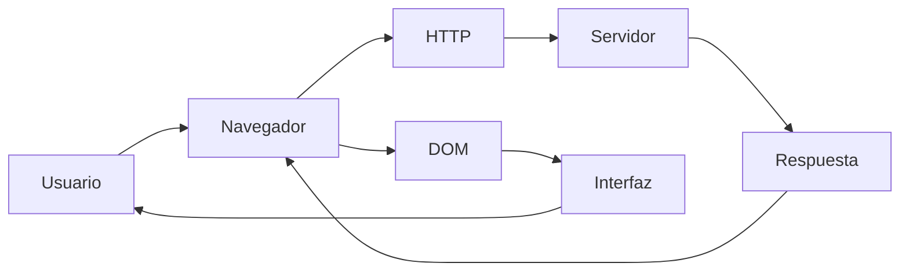
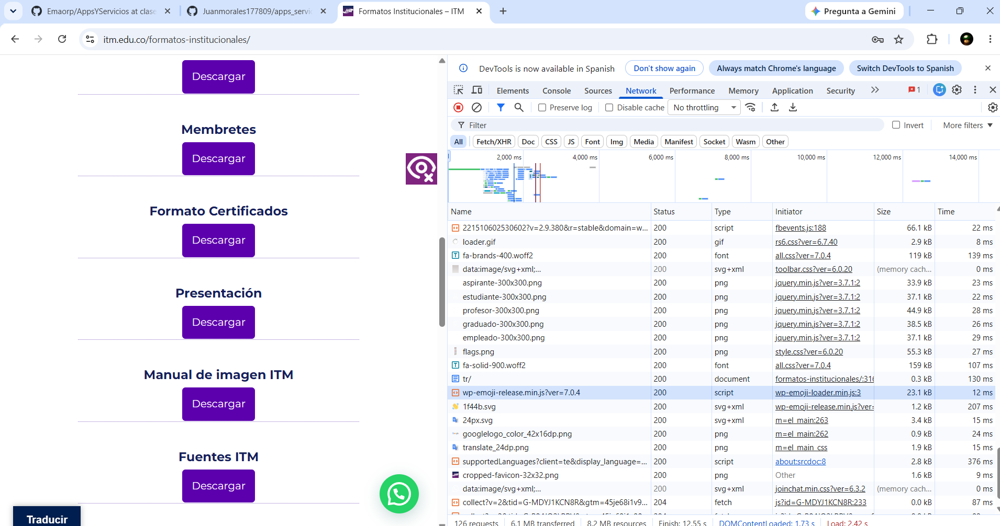
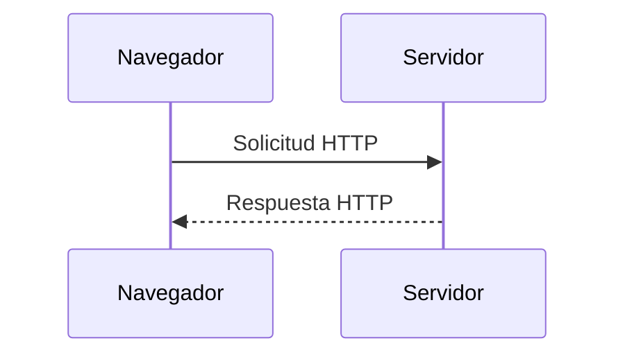
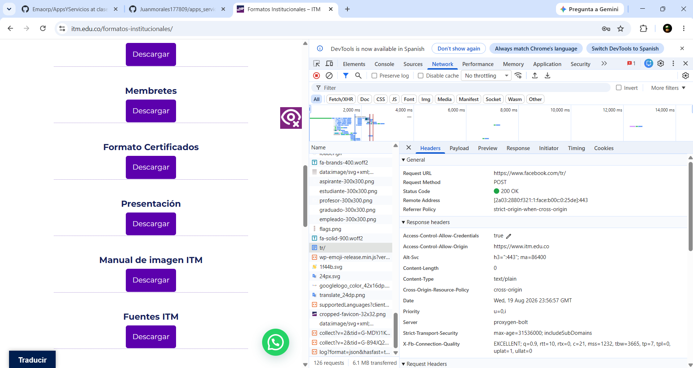
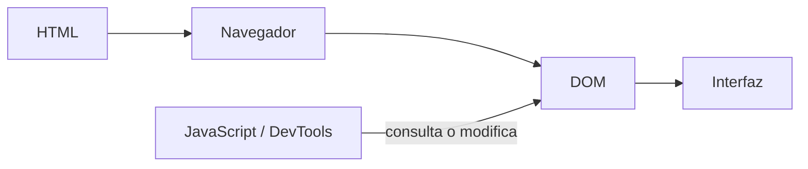
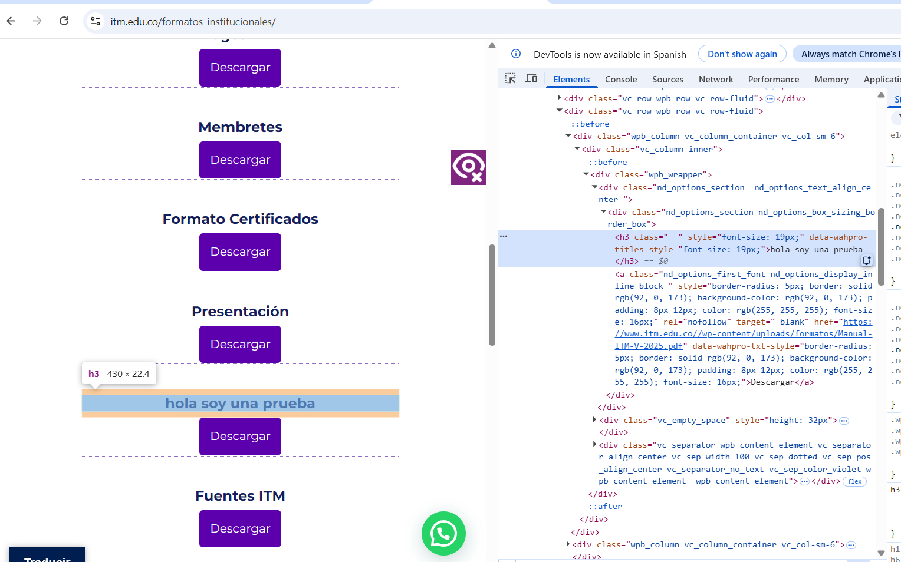
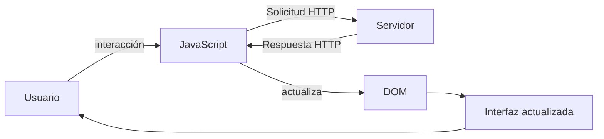
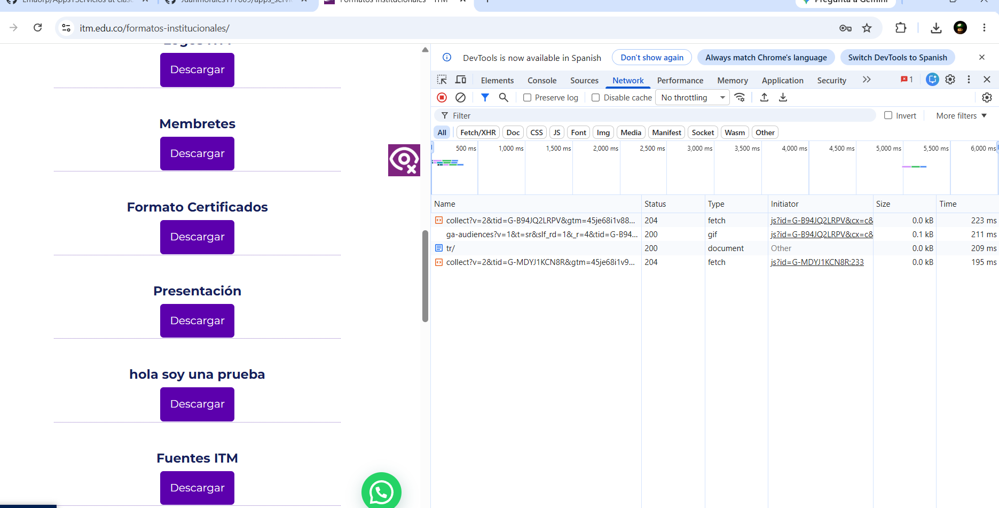
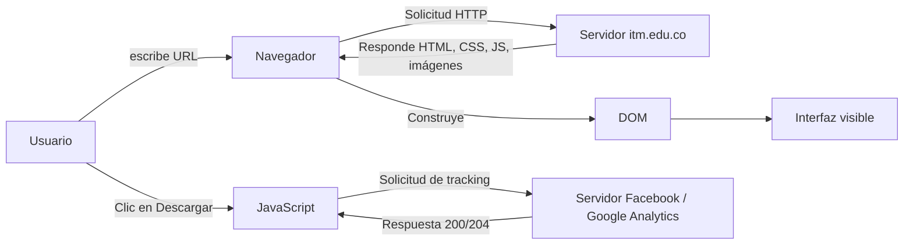

# Laboratorio 01 --- Análisis del funcionamiento de una aplicación web

> **Curso:** Aplicaciones y Servicios Web\
> **Modalidad:** Práctica de laboratorio\
> **Entrega:** Repositorio GitHub --- archivo `README.md`\
> **Evidencias:** Carpeta `evidencias/`

------------------------------------------------------------------------

## Objetivo de la práctica

Analizar el funcionamiento de una aplicación web real mediante las
herramientas de desarrollo del navegador, identificando los recursos
cargados, las solicitudes y respuestas HTTP, la estructura DOM y las
interacciones entre cliente y servidor.

## Resultado esperado

Al finalizar la práctica, el estudiante deberá poder reconstruir y
documentar el flujo observado entre:



> El diagrama anterior representa los **componentes que serán
> analizados**. El diagrama final de la práctica deberá ser construido
> por el estudiante a partir de sus propias observaciones.

------------------------------------------------------------------------

# 1. Preparación del entorno

1.  Ingrese a la aplicación web indicada por el docente.
2.  Abra las **herramientas de desarrollo** del navegador.
3.  Identifique las herramientas **Red / Network** y **Elementos /
    Elements**.
4.  Cree la siguiente estructura dentro del repositorio:

``` text
laboratorio-01/
├── README.md
└── evidencias/
```

El archivo `README.md` será el informe de la práctica. La carpeta
`evidencias/` contendrá las capturas utilizadas para sustentar los
resultados.

------------------------------------------------------------------------

# 2. Identificación de recursos de la aplicación

Abra la herramienta **Red / Network** y recargue completamente la
aplicación.

Observe las solicitudes generadas durante la carga e identifique como
mínimo **cinco recursos**, procurando seleccionar tipos diferentes:
documento HTML, CSS, JavaScript, imágenes, fuentes u otros.

## Resultados

Complete la tabla:
| Recurso | Tipo | Dominio | Tamaño |
|---|---|---|---|
| `formatos-institucionales/` | Documento HTML | itm.edu.co | 0.3 kB |
| `tr/` (Pixel Facebook) | Fetch/XHR (tracking) | facebook.com | 0.3 kB |
| `fa-brands-400.woff2` | Fuente | use.fontawesome.com | 119 kB |
| `aspirante-300x300.png` | Imagen | itm.edu.co | 33.9 kB |
| `wp-emoji-release.min.js` | JavaScript | itm.edu.co | 22.75 kB |

**Total de solicitudes observadas:** `126`
                             
                             

## Evidencia

Guarde una captura de la pestaña Network como:

``` text
evidencias/network.png
```

Inclúyala aquí:





### Análisis

**¿Por qué una sola URL puede generar múltiples solicitudes HTTP?**

> Porque cuando el navegador carga la pagina no solo pide el HTML, tambien trae todo lo que necesita la pagina para verse bien. Imagenes, estilos, fuentes... cada cosa es un archivo distinto y se pide por separado. 


------------------------------------------------------------------------

# 3. Análisis de una solicitud HTTP

En **Network**, seleccione una de las solicitudes realizadas por el
navegador, preferiblemente la correspondiente al documento principal.

Identifique la información solicitada a continuación.

| Elemento | Resultado |
|---|---|
| URL | https://www.facebook.com/tr/ |
| Método HTTP | POST |
| Código de estado | 200 |
| Host / dominio | facebook.com |
| Tipo de recurso | document (tracking - Facebook Pixel) |
| Tiempo de respuesta | 130 ms |

## Flujo que se está observando



## Evidencia

Guarde una captura de los detalles de la solicitud como:

``` text
evidencias/request.png
```

Inclúyala en el informe:




### Análisis

**¿Qué recurso solicitó el navegador?**

> Se solicitó el endpoint /tr/ de Facebook, Facebook Pixel, que registra la visita del usuario con fines de analisis y  publicidad.

**¿Qué información permite determinar si la solicitud fue atendida
correctamente?**

> El código de estado 200 OK confirma que se proceso correctamente. 

------------------------------------------------------------------------

# 4. Inspección del DOM

Seleccione un elemento visible de la aplicación, por ejemplo:

-   un botón;
-   un título;
-   un enlace;
-   un campo de formulario;
-   un elemento del menú.

Utilizando **Elementos / Elements**:

1.  Localice el elemento dentro del DOM.
2.  Identifique la etiqueta HTML utilizada.
3.  Modifique temporalmente su contenido desde las herramientas de
    desarrollo.
4.  Observe el cambio producido en la interfaz.
5.  Registre la evidencia.

## Resultados

**Elemento seleccionado:** `Título del formato "Manual ITM"`

**Etiqueta HTML:** `<h3>`

**Contenido original:** `Manual ITM`

**Modificación realizada:** `Se reemplazó el texto por "hola soy una prueba"`

El proceso observado puede representarse conceptualmente así:



## Evidencia

Guarde la captura como:

``` text
evidencias/dom.png
```

Inclúyala aquí:





### Análisis

**¿La modificación realizada sobre el DOM alteró permanentemente la
aplicación o los archivos almacenados en el servidor? Justifique.**

>No, la modificación fue únicamente local y temporal. Las herramientas permiten editar el DOM directamente en el navegador, pero estos cambios existen solo en la memoria de esa sesión; no se envían ni se guardan en el servidor.

------------------------------------------------------------------------

# 5. Análisis de una interacción dinámica

Regrese a **Network** y limpie las solicitudes registradas.

Realice una acción dentro de la aplicación que pueda generar una
interacción con el servidor, por ejemplo:

-   consultar;
-   buscar;
-   filtrar;
-   seleccionar una opción;
-   enviar información.

Observe si aparece una nueva solicitud en Network.

## Resultados

| Elemento | Resultado |
|---|---|
| Acción realizada | Clic en el botón "Descargar" del formato "Membretes" |
| ¿Generó una nueva solicitud? | Sí |
| URL solicitada | https://www.facebook.com/tr/ y solicitud `collect` a Google Analytics |
| Método HTTP | POST (Facebook) / GET (Google Analytics) |
| Código de estado | 200 (Facebook) / 204 (Google Analytics) |
| Tipo de respuesta | document / fetch (tracking) |

## Ciclo de interacción

Utilice este esquema únicamente como referencia conceptual para
interpretar lo observado:



## Evidencia

Guarde la captura como:

``` text
evidencias/interaccion.png
```

Inclúyala aquí:





### Análisis

**Explique la relación entre la acción realizada por el usuario y la
solicitud observada.**

> Cuando le di clic al botón "Descargar", pasaron dos cosas al mismo tiempo: se descargó el archivo, y por detrás la página le avisó a Google Analytics y a Facebook que hice ese clic (para registrar la interacción). O sea, una sola acción mía terminó generando varias solicitudes: una para lo que yo veía (la descarga) y otras que ni se notan, pero sirven para que el sitio lleve el control de lo que los usuarios hacen.

------------------------------------------------------------------------

# 6. Reconstrucción del flujo observado

A partir de **sus propias evidencias**, construya un diagrama Mermaid
que represente el funcionamiento de la aplicación analizada.

El diagrama deberá incluir, cuando corresponda:

`Usuario` · `Navegador` · `JavaScript` · `Solicitud HTTP` · `Servidor` ·
`Respuesta HTTP` · `DOM` · `Interfaz`

> **No copie los diagramas anteriores.** Esta sección debe representar
> el flujo que usted pudo comprobar durante la práctica.

Reemplace el siguiente bloque con su diagrama:



------------------------------------------------------------------------

# 7. Observado vs. inferido

Una herramienta de desarrollo permite observar una parte del sistema,
pero no necesariamente todo lo que ocurre en el servidor.

Clasifique sus hallazgos:

## Elementos observados directamente

- La página cargó 126 solicitudes en total: HTML, CSS, JS, imágenes y fuentes
- Algunas solicitudes vinieron de fuera del sitio, como Facebook (tr/) y Font Awesome, con respuesta 200 OK
- Al hacer clic en "Descargar" se dispararon solicitudes extra de tracking (Facebook y Google Analytics)

## Elementos inferidos

- El sitio probablemente usa WordPress, porque varios recursos salen de carpetas de ese sistema (wp-content, wp-includes)
- Es probable que el ITM use esos datos de tracking para ver qué formatos descarga más la gente.
- El pixel de Facebook puede usarse para hacer publicidad dirigida, aunque tampoco se puede comprobar eso desde el navegador

> No presente como observado un proceso interno que las herramientas del
> navegador no permitan comprobar directamente.

------------------------------------------------------------------------

# 8. Conclusiones

Redacte **tres conclusiones técnicas** derivadas de la práctica.

1. Una página web no es un solo archivo, son muchas piezas juntas. Aunque yo solo escribí una URL, el navegador terminó pidiendo 126 cosas distintas (imágenes, estilos, scripts), y algunas ni siquiera venían del sitio del ITM sino de otras páginas como Facebook.
2. Lo que veo en pantalla no es lo mismo que lo que está guardado en el servidor. Cuando cambié el texto desde las herramientas del navegador, se veía distinto en mi pantalla, pero eso no cambió nada de verdad; si recargo la página, vuelve a como estaba.
3. Cuando uno hace clic en algo, pasan más cosas de las que uno ve. Al darle a "Descargar", no solo se descargó el archivo, sino que por detrás la página le avisó a Facebook y a Google que hice clic ahí, sin que yo lo notara a simple vista.

Las conclusiones deben explicar lo aprendido a partir de la evidencia y
no limitarse a describir las actividades realizadas.

------------------------------------------------------------------------

# 9. Entrega

La estructura final esperada es:

``` text
laboratorio-01/
├── README.md
└── evidencias/
    ├── network.png
    ├── request.png
    ├── dom.png
    └── interaccion.png
```

Antes de entregar, verifique:

-   [ ] El `README.md` se visualiza correctamente en GitHub.
-   [ ] Las imágenes se muestran dentro del README.
-   [ ] Se documentaron al menos cinco recursos.
-   [ ] Se analizó una solicitud HTTP.
-   [ ] Se identificó y modificó un elemento del DOM.
-   [ ] Se analizó una interacción de la aplicación.
-   [ ] El diagrama final corresponde a lo observado.
-   [ ] Se diferenciaron elementos observados e inferidos.
-   [ ] Se redactaron tres conclusiones técnicas.
-   [ ] Se realizó `commit` y `push` al repositorio.

------------------------------------------------------------------------

## Criterio de documentación

> **Las capturas son evidencia, no la respuesta.**

Cada evidencia debe estar acompañada por una explicación que indique
**qué se observó, qué significa y cómo se relaciona con el
funcionamiento de la aplicación web**.
