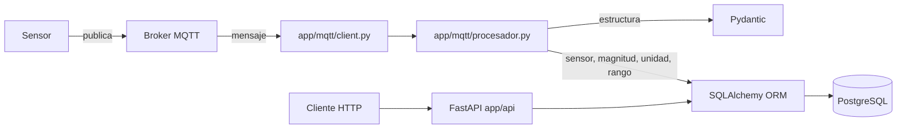

# Taller 2 — API para adquisición, validación y consulta de datos IoT

## 1. Información general

| Campo | Valor |
|---|---|
| Proyecto | API IoT con FastAPI, MQTT y PostgreSQL |
| Integrantes | Emanuel Ortiz Pérez y Brayan Alexis Espinosa (grupo de dos) |
| Asignatura | Aplicaciones y Servicios Web |
| Fecha | 10 de octubre de 2026 |
| Sensor asignado | **Ninguno.** No se solicitó asignación dentro del plazo (hasta el 9 de octubre). |
| Tópico MQTT utilizado | `iot/sensors/TEST-001/data` (el tópico de ejemplo de la guía), configurable con `MQTT_TOPIC` |

> **Nota de alcance (leer primero).** No tenemos sensor asignado porque se nos paso solicitarlo. Para no usar el sensor de otro grupo ni guardar datos
> en él (la guía pide usar únicamente el sensor y tópico asignados y no modificar datos de otros grupos), el consumidor
> quedó configurado con el tópico de ejemplo de la guía, `iot/sensors/TEST-001/data`.
>
> Al consultar el catálogo (`GET /sensores`) se comprobó que **`TEST-001` no existe en la base de datos**. Por lo tanto,
> si llegara un mensaje de ese tópico, esta aplicación lo **rechazaría** (sensor inexistente) y no guardaría nada.
> **Esta aplicación no ha almacenado ninguna medición.**
>
> El código no depende de ese sensor: con un sensor asignado solo habría que cambiar `MQTT_TOPIC` en el `.env`
> (por ejemplo `iot/sensors/<codigo>/data`). El estado real de cada evidencia está en la sección 7.

## 2. Descripción del sistema

**Problema resuelto.** Una infraestructura IoT publica mediciones por MQTT. La aplicación recibe esos mensajes,
comprueba que sean correctos, guarda solo los válidos en PostgreSQL y permite consultarlos por HTTP.

**Arquitectura.**



La API y el consumidor MQTT corren en el mismo proceso: al arrancar `uvicorn`, el consumidor se inicia en un hilo
aparte y se detiene al apagar la API.

**Reglas de validación de cada mensaje** (en `procesar_mensaje`, archivo `app/mqtt/procesador.py`):

1. JSON válido.
2. Estructura, campos obligatorios, tipos y timestamp (Pydantic). El valor debe ser un número real (un texto como `"24.6"` se rechaza). El timestamp debe ser texto ISO 8601 con zona horaria.
3. El `sensor_id` del mensaje debe ser el del tópico suscrito. Así nunca se guardan datos de un sensor de otro grupo.
4. El sensor existe (`codigo` en `sensores`) y está activo.
5. Cada magnitud pertenece al sensor (`sensor_magnitudes`).
6. La unidad coincide con la configurada.
7. El valor está entre `valor_minimo` y `valor_maximo`.
8. Solo si **todas** las magnitudes son válidas se guarda el mensaje, una fila por magnitud y todas con el mismo `timestamp_utc`, en una sola transacción.

**Payload.** Formato definido por la guía:

```json
{
  "sensor_id": "TEST-001",
  "timestamp": "2026-10-07T16:25:30Z",
  "measurements": {
    "temperature": { "value": 24.6, "unit": "C" }
  }
}
```

**Payload real: no disponible.** Sin sensor asignado no se capturó un mensaje propio. La estructura anterior es la que
define la guía. En el tópico `TEST-001` la aplicación se conectó y se suscribió correctamente
(`evidencias/registro_mqtt.txt`); si ese archivo no contiene líneas `RECIBIDO`, es porque no llegó ningún mensaje.

Como referencia, el catálogo de la base (`GET /sensores/1/magnitudes`) indica para el sensor `AQ-001` estas magnitudes,
unidades y rangos válidos:

| Magnitud | Unidad | Mínimo | Máximo |
|---|---|---|---|
| `co2` | `ppm` | 300 | 5000 |
| `humidity` | `%` | 0 | 100 |
| `temperature` | `C` | 10 | 45 |

En las consultas de lectura sobre `AQ-001` (datos que guardaron otros grupos, no esta aplicación) se observó que cada
publicación genera una fila por magnitud con el mismo timestamp, aproximadamente cada 5 segundos.

## 3. Configuración del entorno

```powershell
python -m venv venv
venv\Scripts\activate
pip install -r requirements.txt
copy .env.example .env     # y completar los valores (el .env NO se sube a GitHub)
```

- `requirements.txt` lista las dependencias de ejecución (FastAPI, Uvicorn, SQLAlchemy, psycopg2, python-dotenv, paho-mqtt, requests).
- `requirements-dev.txt` agrega `pytest` y `httpx` para las pruebas automáticas.

Variables de entorno requeridas (sin valores sensibles): `POSTGRES_HOST`, `POSTGRES_PORT`, `POSTGRES_DB`,
`POSTGRES_USER`, `POSTGRES_PASSWORD`, `MQTT_BROKER`, `MQTT_PORT`, `MQTT_TOPIC`, `MQTT_USERNAME`,
`MQTT_PASSWORD`, `MQTT_KEEPALIVE`. Ver `.env.example`.

Ejecución:

```powershell
uvicorn app.main:app --reload
```

Documentación interactiva en `http://127.0.0.1:8000/docs`.

## 4. Base de datos

- Conexión: SQLAlchemy con el driver `psycopg2`; la URL se arma desde variables de entorno en `app/database/connection.py`.
- Tablas utilizadas: `sensores`, `sensor_magnitudes`, `mediciones` (descritas en `data-model.md`).
- El catálogo (`sensores`, `sensor_magnitudes`) es del docente: la aplicación **solo lo consulta**. No se llama a `create_all` y no hay endpoints ni funciones que lo modifiquen.
- Relaciones implementadas con claves foráneas:
  - `sensores` 1:N `sensor_magnitudes` (`sensor_magnitudes.sensor_id` → `sensores.id`)
  - `sensor_magnitudes` 1:N `mediciones` (`mediciones.sensor_magnitud_id` → `sensor_magnitudes.id`)
- Correspondencia con `data-model.md`: cada columna, tipo (`Numeric(12,4)`, `DateTime(timezone=True)`, `BigInteger`…) y FK del documento está representada en `app/models/`.
- El timestamp se guarda en UTC (`timestamp_utc`) y en las respuestas GET se convierte a hora de Colombia (UTC-5, sin horario de verano) con el formato `2026-10-07 11:25:30 (UTC-05:00)`.

## 5. Organización del código

```text
app/
├── main.py                  # crea la API, registra routers y arranca/detiene MQTT
├── database/connection.py   # engine, sesión y get_db
├── models/                  # tablas como clases SQLAlchemy ORM
├── schemas/                 # validación y forma de entrada/salida con Pydantic
├── crud/                    # consultas a la base (sensor y sensor_magnitud: solo lectura; medicion: crear y consultar)
├── api/                     # endpoints FastAPI; traducen resultados a códigos HTTP
├── mqtt/
│   ├── client.py            # conexión al broker, suscripción y callbacks
│   └── procesador.py        # validación completa y guardado de cada mensaje
└── utils/tiempo.py          # conversión UTC <-> hora de Colombia
pruebas/                     # scripts que generan las evidencias
tests/                       # pruebas automáticas (pytest)
evidencias/                  # resultados de las pruebas
```

| Carpeta | Función |
|---|---|
| `schemas/` | Estructura del mensaje MQTT (`MqttPayload`) y formato de las respuestas HTTP |
| `models/` | Mapeo de las tablas de PostgreSQL |
| `crud/` | Único lugar donde se escriben consultas a la base |
| `api/` | Rutas HTTP, manejo de errores 400/404/422 |
| `mqtt/` | Consumo de mensajes y reglas de negocio de validación |
| `database/` | Conexión y sesiones |

## 6. Endpoints implementados

| Método | Ruta | Descripción |
|---|---|---|
| GET | `/sensores` | Lista los sensores |
| GET | `/sensores/{id}` | Sensor por id |
| GET | `/sensores/por-codigo/{codigo}` | Sensor por su código |
| GET | `/sensores/{id}/magnitudes` | Magnitudes del sensor (unidad y rango) |
| GET | `/sensor-magnitudes/{id}` | Relación sensor-magnitud por id |
| GET | `/mediciones/{id}` | Medición por id |
| GET | `/sensores/{id}/mediciones` | Histórico. Filtros combinables: `magnitud`, `desde`, `hasta`, `limit` |
| GET | `/sensores/{id}/ultima-medicion` | Medición más reciente |
| GET | `/health` | Estado de la base de datos y de la conexión MQTT |

Reglas de las consultas históricas:

- Resultados ordenados de la más reciente a la más antigua. `limit` (1 a 1000, por defecto 100) devuelve las últimas N.
- `desde` y `hasta` sin zona horaria se interpretan como hora de Colombia.
- `desde > hasta` → **400**. Id, fecha o `limit` con formato inválido → **422**. Recurso o magnitud inexistente → **404**.

## 7. Evidencias de funcionamiento

Las evidencias están en la carpeta `evidencias/` y se generan ejecutando los scripts de `pruebas/`
(la API debe estar corriendo para `probar_endpoints`):

```powershell
python -m pruebas.escuchar_mqtt                          # mensajes recibidos (evidencia 1)
python -m pruebas.probar_validaciones --sensor <CODIGO>  # rechazos (3 a 7)
python -m pruebas.ver_mediciones --sensor <CODIGO>       # filas en PostgreSQL (2)
python -m pruebas.probar_endpoints --sensor-id <ID>      # códigos HTTP (8 a 16)
pytest                                                   # pruebas automáticas (requiere requirements-dev.txt)
```

El registro de ejecución del consumidor MQTT se guarda en `evidencias/registro_mqtt.txt`
(líneas `RECIBIDO`, `ACEPTADO` y `RECHAZADO` con el motivo).

| # | Prueba | Archivo de evidencia | Lógica (archivo → función) |
|---|---|---|---|
| 1 | Recepción MQTT | `evidencias/registro_mqtt.txt` | `app/mqtt/client.py` → `ConsumidorMqtt._on_message` |
| 2 | Medición válida | **No disponible** (sin sensor asignado no se almacenó ninguna medición) | `app/mqtt/procesador.py` → `procesar_mensaje`; `app/crud/medicion.py` → `crear_lote` |
| 3 | Sensor inexistente | `evidencias/validaciones_mqtt.txt` | `procesar_mensaje` (paso 4) |
| 4 | Unidad incorrecta | `evidencias/validaciones_mqtt.txt` | `procesar_mensaje` (paso 6) |
| 5 | Tipo de dato incorrecto | `evidencias/validaciones_mqtt.txt` | `app/schemas/medicion.py` → `MagnitudPayload` |
| 6 | Magnitud incorrecta | `evidencias/validaciones_mqtt.txt` | `procesar_mensaje` (paso 5) |
| 7 | Timestamp inválido | `evidencias/validaciones_mqtt.txt` | `app/schemas/medicion.py` → `MqttPayload` (validadores de `timestamp`) |
| 8 | Consulta por ID existente | `evidencias/endpoints_http.txt` | `app/api/medicion.py` → `obtener_medicion` |
| 9 | Consulta por ID inexistente (404) | `evidencias/endpoints_http.txt` | `app/api/medicion.py` → `obtener_medicion` |
| 10 | Consulta histórica | `evidencias/endpoints_http.txt` | `app/api/medicion.py` → `listar_mediciones_del_sensor` |
| 11 | Consulta por rango de fechas | `evidencias/endpoints_http.txt` | `listar_mediciones_del_sensor`; `app/crud/medicion.py` → `listar_por_sensor` |
| 12 | `desde > hasta` (400) | `evidencias/endpoints_http.txt` | `listar_mediciones_del_sensor` |
| 13 | Validación HTTP incorrecta (422) | `evidencias/endpoints_http.txt` | Validación automática de FastAPI (`Query(ge=1)`, parámetros tipados) |
| 14 | Última medición | `evidencias/endpoints_http.txt` | `app/api/medicion.py` → `ultima_medicion_del_sensor` |
| 15 | Últimas N mediciones | `evidencias/endpoints_http.txt` | `listar_mediciones_del_sensor` (`limit`) |
| 16 | Filtro por magnitud | `evidencias/endpoints_http.txt` | `listar_mediciones_del_sensor` (`magnitud`) |
| 17 | Claves foráneas | `app/models/` | `SensorMagnitud.sensor_id` y `Medicion.sensor_magnitud_id` (`ForeignKey` + `relationship`) |
| 18 | Separación de responsabilidades | sección 5 | `schemas/`, `models/`, `crud/`, `api/`, `mqtt/`, `database/` |

Además, `tests/` contiene pruebas automáticas (`pytest`) de las validaciones MQTT y de los endpoints, con una base
SQLite temporal que no toca PostgreSQL.

### Estado real de las evidencias

Sin sensor asignado, **esta aplicación no almacenó ninguna medición** y no se cumplió la recolección de 20 minutos que
pide la guía. Se prefirió no suscribirse al sensor de otro grupo para no guardar datos en él. Estado de cada evidencia:

| Evidencias | Estado | Cómo se obtuvo |
|---|---|---|
| 1. Recepción MQTT | **Parcial** | Conexión y suscripción registradas. No hay mensajes recibidos: durante la ejecución no llegó ninguno a ese tópico. |
| 2. Medición válida en PostgreSQL | **No disponible** | Requiere un sensor asignado. No se almacenó nada. |
| 3 a 7. Mensajes rechazados | **Completas** | `python -m pruebas.probar_validaciones --sensor AQ-001`, en modo simulación (no escribe en la base) sobre la base real. |
| 8, 10, 11, 14, 15, 16 | **Ejecutadas en solo lectura** | Los endpoints funcionan contra la base real. Los datos devueltos de `AQ-001` pertenecen a otro grupo y se leyeron con `GET`; no son mediciones de esta aplicación. |
| 9, 12, 13 (404, 400, 422) | **Completas** | `evidencias/endpoints_http.txt`. |
| 17 y 18 | **Completas** | Ver `app/models/` y la sección 5. |

| Dato | Valor |
|---|---|
| Sensor usado en la recolección | Ninguno (sin asignación) |
| Tiempo de recolección | 0 minutos |
| Mediciones almacenadas por esta aplicación | 0 |
| Sensor de referencia para las pruebas de lectura y de simulación | `AQ-001` (solo lectura) |

## 8. Control de versiones

- Repositorio: https://github.com/Emaorp/AppsYServicios (rama `taller-2`)
- El taller lo realizamos Emanuel Ortiz Pérez y Brayan Alexis Espinosa, lo hicimos juntos presencialmente y se nos pasó el tema de separar los commits.

## 9. Conclusiones

- **Aprendizajes.** Validar en capas (estructura con Pydantic, reglas de negocio con el ORM) hace que cada regla viva en un solo lugar y que sea fácil de probar. MQTT desacopla al sensor de la aplicación: el sensor publica y la aplicación decide qué guardar.
- **Dificultades.** No se contó con un sensor asignado dentro del plazo, por lo que no se pudo recolectar ni almacenar datos reales y las evidencias que dependen de ellos (2 y la recolección de 20 minutos) quedaron sin cumplirse. Además, guardar timestamps en UTC y mostrarlos en hora local exige convertir con cuidado en cada respuesta.
- **Soluciones.** El tópico, el broker y las credenciales se configuran por variables de entorno, así que cambiar al sensor asignado no requiere tocar el código. Los mensajes de otro sensor se rechazan comparando el `sensor_id` con el tópico, y las pruebas de rechazo se ejecutan en modo simulación para no escribir datos de prueba en la base compartida.
